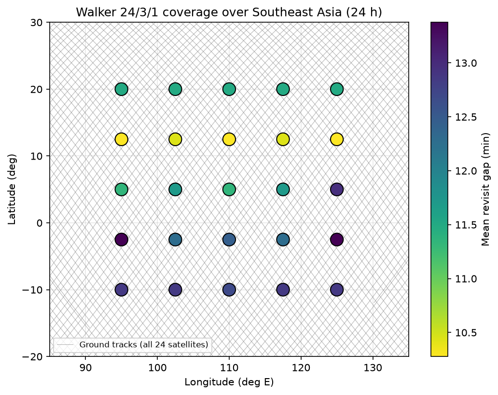
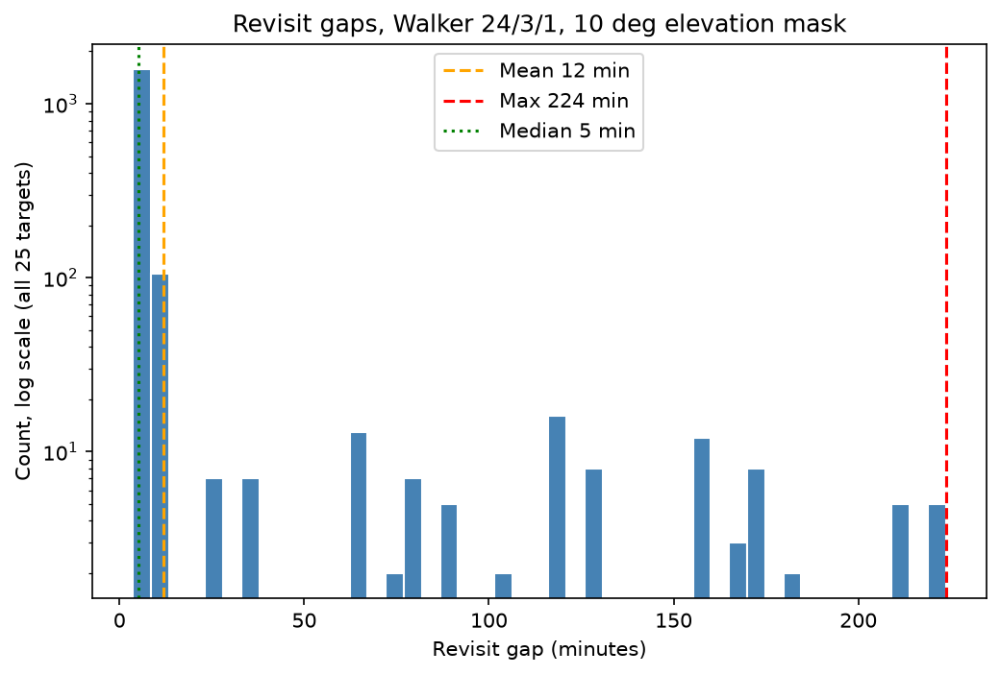
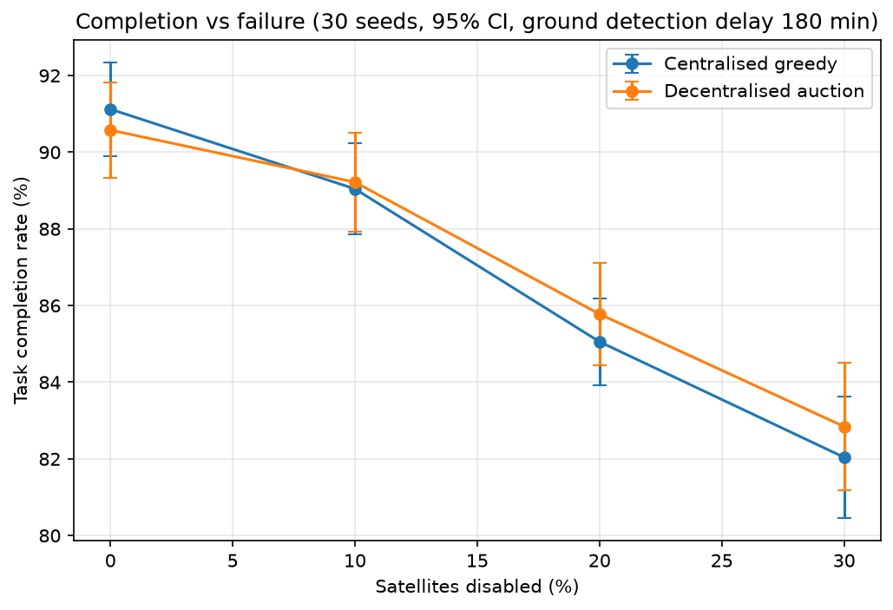
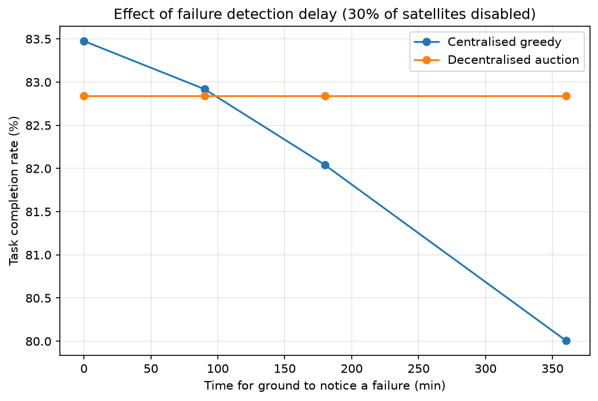

# Satellite constellation simulator: coverage and tasking under failure

A 24-hour simulation of a Walker Delta 24/3/1 constellation (550 km, 53°) over a 5 × 5 target grid in Southeast Asia. It measures revisit performance, then compares a centralised greedy scheduler with a decentralised auction for imaging requests, including when satellites fail.

## How to run

```
pip install -r requirements.txt
python tests.py      # sanity checks, every line should say PASS
python run_all.py    # about 15 seconds; writes figures/ and results/
```

All settings live in `config.py`.

## Results

| Metric | Value |
|---|---|
| Orbital period | 95.65 min |
| Mean revisit gap (all targets) | 11.8 min |
| Median revisit gap | 5.1 min |
| Max revisit gap (worst target) | 223.7 min |
| Share of day each target is in view | 33% |
| Completion, centralised, 0% failure | 91.1% ± 1.2% |
| Completion, auction, 0% failure | 90.6% ± 1.2% |
| Completion, centralised, 30% failure | 82.0% ± 1.6% |
| Completion, auction, 30% failure | 82.8% ± 1.7% |
| Mean latency, centralised, 0% / 30% | 70 / 80 min |
| Mean latency, auction, 0% / 30% | 69 / 82 min |

± values are 95% confidence intervals over 30 random seeds. Both schemes see identical requests and identical failures in each seed.






## What the results show

**Revisit.** Gaps are strongly bimodal. Satellites in the same plane are 45° apart, so they pass over a target in a "train" a few minutes apart (median gap 5 min), followed by outages of up to about 3.7 hours while the planes are elsewhere. The mean alone hides this, which is why the median and maximum are reported too. Low latitudes are served slightly worse than 12.5–20°N, as expected for a 53° inclination.

**Tasking.** With no failures, centralised greedy is marginally better (it sees everything instantly). As satellites fail, the auction degrades slightly more gracefully, but at a 180-minute detection delay the difference at 30% failure (82.8% vs 82.0%) is within the confidence intervals, so it is not a significant win on its own.

**The real driver is detection delay.** The bonus plot varies how long the ground takes to notice a dead satellite. With instant detection, centralised wins (83.5% vs 82.8%). The auction's performance does not depend on this delay at all, because a dead satellite simply stops bidding. Centralised falls behind once detection takes more than about 90 minutes, and by 6 hours it trails by about 3 percentage points. The advantage of decentralisation here is robustness to slow or missing ground knowledge, not better scheduling.

## Method

1. **Constellation.** Walker 24/3/1: 3 planes at RAAN 0°, 120°, 240°; 8 satellites per plane 45° apart; 15° phase shift between adjacent planes.
2. **Propagation.** Exact circular two-body motion at 10 s steps over 24 h.
3. **Frames.** ECI to ECEF by rotating about the z-axis at the sidereal rate (7.2921159 × 10⁻⁵ rad/s), starting from GMST at the epoch (from Skyfield).
4. **Access.** A target sees a satellite when elevation exceeds 10°. Window edges are interpolated between samples.
5. **Revisit gap.** End of one covered period to the start of the next, after merging all satellites' windows per target. The partial periods at the start and end of the day are excluded.
6. **Requests.** Poisson arrivals, 6 per hour, over the first 18 h, uniformly random targets, 3 h deadline.
7. **Capacity.** One image per *regional pass*: a continuous period in which a satellite sees any grid target. (A satellite sees several targets at once, so "one target per pass" is defined per regional pass.)
8. **Centralised greedy.** On arrival, assign the request to the free pass with the earliest imaging time across all satellites the ground believes are alive.
9. **Decentralised auction.** Requests reach each satellite after an independent 5–30 s delay. A satellite with a free pass bids (earlier imaging time = higher bid), broadcasts its bid (another 5–30 s delay) and waits 60 s on its own clock. Highest bid wins; ties go to the lowest satellite ID. A bidding satellite locks its pass until the auction resolves. Winners broadcast a "done" message after imaging; if losers hear nothing by the expected time, they assume the winner failed and re-auction.
10. **Failures.** 10/20/30% of 24 satellites = 2/5/7 satellites, failing at random times in the first 18 h. The ground notices after a detection delay (default 180 min) and then re-plans lost tasks.

**Validation.** `tests.py` checks orbit radius and period, 53° maximum latitude, Walker spacing, 90° elevation directly overhead, Earth rotation rate, maximum pass length (about 8.3 min), and that the auction with zero message delay reproduces the centralised result exactly.

## Assumptions and limitations

- **No J2.** Orbits are ideal two-body circles and Earth's oblateness (J2) is ignored. At 550 km and 53°, J2 would regress each plane's ascending node by about 4.5° per day. Because every satellite shares the same altitude and inclination, the whole constellation drifts together, so relative geometry and daily revisit statistics are only mildly affected. Absolute pass times are not: by the end of the day ground tracks would be displaced by roughly 500 km, so this simulator should not be used to predict real pass times or run beyond a few days.
- Spherical Earth; Earth rotation only (no precession, nutation or polar motion).
- No sensor pointing limits beyond the 10° mask, no cloud cover, no onboard storage or downlink constraints.
- The centralised scheduler is assumed to reach satellites instantly; only failure *detection* is delayed.
- The auction assumes crosslinks between all satellites with 5–30 s delay and no message loss.
- Several targets lie over sea; this is a coverage study, not a land-imaging study.
